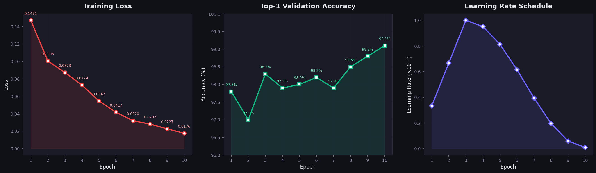
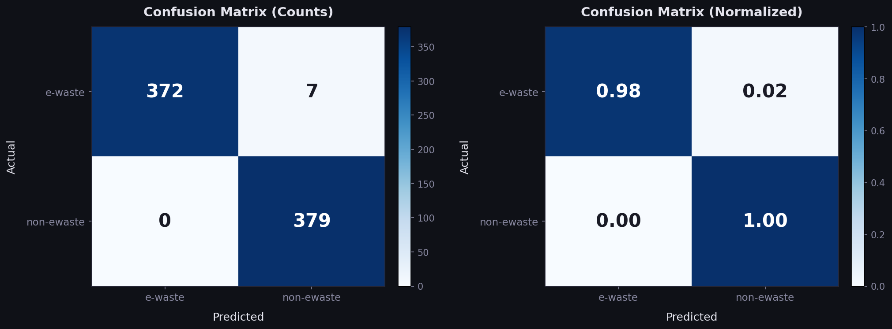

# E-Waste Binary Classifier — Technical Report

> **Final Model Accuracy: 99.08% (Top-1) | 100% (Top-5)**  
> Trained on ~16K images | YOLOv8s-cls | 11.2 minutes

---

## 1. Problem Statement

Electronic waste (e-waste) is one of the fastest-growing waste streams globally. Improper disposal of e-waste leads to toxic chemicals leaching into soil and water. This project builds an **automated binary image classifier** that can detect whether a given item is **electronic waste** or **regular waste**, enabling smart waste sorting at recycling facilities, smart bins, or mobile apps.

### Task Definition

| Input                                   | Output                                          |
| --------------------------------------- | ----------------------------------------------- |
| Any image of a waste item (256×256 RGB) | `e-waste` or `non-ewaste` with confidence score |

---

## 2. Dataset

### 2.1 Data Sources

| Source                             | Description                                                                                                                                                   | Original Images |
| ---------------------------------- | ------------------------------------------------------------------------------------------------------------------------------------------------------------- | --------------- |
| **E-Waste Dataset v44** (Roboflow) | YOLO detection dataset with 77 sub-classes of electronic waste — smartphones, laptops, PCBs, TVs, monitors, batteries, keyboards, mice, routers, cables, etc. | 19,525          |
| **TrashType Image Dataset**        | Folder-based classification dataset with 6 waste categories: cardboard, glass, metal, paper, plastic, trash                                                   | 2,527           |
| **Additional non-ewaste images**   | User-curated images added to the non-ewaste class to improve balance and diversity                                                                            | ~5,325          |

### 2.2 Binary Class Construction

The multi-class datasets were consolidated into a **binary classification** task:

| Class          | Composition                                                          | Description                                                                            |
| -------------- | -------------------------------------------------------------------- | -------------------------------------------------------------------------------------- |
| **e-waste**    | All images from E-Waste Dataset (labels discarded, only images used) | Phones, laptops, PCBs, TVs, batteries, monitors, keyboards, cables, etc.               |
| **non-ewaste** | All 6 garbage categories merged + additional curated images          | Cardboard, glass, metal, paper, plastic, general trash, and misc. non-electronic items |

### 2.3 Final Dataset Splits

| Split          | e-waste | non-ewaste | Total      | Ratio          |
| -------------- | ------- | ---------- | ---------- | -------------- |
| **Train**      | 8,014   | 7,852      | **15,866** | ~50.5% / 49.5% |
| **Validation** | 379     | 379        | **758**    | 50% / 50%      |
| **Test**       | 380     | 380        | **760**    | 50% / 50%      |
| **Total**      | 8,773   | 8,611      | **17,384** | —              |

**Class balance ratio**: 1.02:1 (nearly perfectly balanced — no bias issues).

### 2.4 Dataset Directory Structure

```
data/binary_dataset/
├── train/
│   ├── e-waste/         (8,014 images)
│   └── non-ewaste/      (7,852 images)
├── val/
│   ├── e-waste/         (379 images)
│   └── non-ewaste/      (379 images)
└── test/
    ├── e-waste/         (380 images)
    └── non-ewaste/      (380 images)
```

---

## 3. Model Architecture

### 3.1 Overview

| Property            | Value                                                          |
| ------------------- | -------------------------------------------------------------- |
| **Framework**       | Ultralytics YOLOv8 v8.4.16                                     |
| **Model Variant**   | YOLOv8s-cls (Small Classification)                             |
| **Backbone**        | Modified CSPDarknet53 with C2f (Cross Stage Partial v2) blocks |
| **Head**            | Classify head — Conv → GAP → Linear → Softmax                  |
| **Total Layers**    | 56 (unfused) / 30 (fused for inference)                        |
| **Parameters**      | 5,083,298 (trainable) / 5,077,762 (fused)                      |
| **GFLOPs**          | 12.6 (training) / 12.4 (inference, fused)                      |
| **Model File Size** | 10.3 MB                                                        |
| **Pretrained On**   | ImageNet-1K (1000-class general object recognition)            |
| **Transfer Items**  | 156/158 layers transferred from pretrained weights             |

### 3.2 Layer-by-Layer Architecture

```
Layer  From   N   Params     Module                           Arguments
─────────────────────────────────────────────────────────────────────────
  0     -1    1      928     Conv                             [3, 32, 3, 2]
  1     -1    1   18,560     Conv                             [32, 64, 3, 2]
  2     -1    1   29,056     C2f                              [64, 64, 1, True]
  3     -1    1   73,984     Conv                             [64, 128, 3, 2]
  4     -1    2  197,632     C2f                              [128, 128, 2, True]
  5     -1    1  295,424     Conv                             [128, 256, 3, 2]
  6     -1    2  788,480     C2f                              [256, 256, 2, True]
  7     -1    1 1,180,672    Conv                             [256, 512, 3, 2]
  8     -1    1 1,838,080    C2f                              [512, 512, 1, True]
  9     -1    1  660,482     Classify                         [512, 2]
─────────────────────────────────────────────────────────────────────────
                  5,083,298  Total parameters
```

### 3.3 Data Flow Diagram

```
Input Image (256×256×3)
    │
    ├── Layer 0: Conv2d(3→32, k=3, s=2) + BN + SiLU
    │   Output: 128×128×32
    │
    ├── Layer 1: Conv2d(32→64, k=3, s=2) + BN + SiLU
    │   Output: 64×64×64
    │
    ├── Layer 2: C2f(64→64, n=1, shortcut=True)
    │   ├── Split → Bottleneck (Conv 3×3 → Conv 3×3) → Concat
    │   Output: 64×64×64
    │
    ├── Layer 3: Conv2d(64→128, k=3, s=2) + BN + SiLU
    │   Output: 32×32×128
    │
    ├── Layer 4: C2f(128→128, n=2, shortcut=True)
    │   ├── Split → 2× Bottleneck → Concat
    │   Output: 32×32×128
    │
    ├── Layer 5: Conv2d(128→256, k=3, s=2) + BN + SiLU
    │   Output: 16×16×256
    │
    ├── Layer 6: C2f(256→256, n=2, shortcut=True)
    │   ├── Split → 2× Bottleneck → Concat
    │   Output: 16×16×256
    │
    ├── Layer 7: Conv2d(256→512, k=3, s=2) + BN + SiLU
    │   Output: 8×8×512
    │
    ├── Layer 8: C2f(512→512, n=1, shortcut=True)
    │   ├── Split → Bottleneck → Concat
    │   Output: 8×8×512
    │
    └── Layer 9: Classify Head
        ├── Conv2d(512→1024, k=1) + BN + SiLU  →  8×8×1024
        ├── Global Average Pooling              →  1×1×1024
        ├── Dropout(p=0.0)                      →  1024
        ├── Linear(1024 → 2)                    →  2
        └── Softmax                             →  [P(e-waste), P(non-ewaste)]
```

### 3.4 Key Architectural Components

| Component                  | What It Does                                                                                                                                | Why It Matters                                                         |
| -------------------------- | ------------------------------------------------------------------------------------------------------------------------------------------- | ---------------------------------------------------------------------- |
| **C2f Block**              | Cross Stage Partial v2 — splits features into two paths, one goes through bottleneck layers, then fuses. More efficient than ResNet blocks. | Extracts rich multi-scale features with fewer parameters               |
| **SiLU (Swish)**           | Activation function: `x × σ(x)`. Smooth, non-monotonic.                                                                                     | Better gradient flow than ReLU, especially in deep networks            |
| **Batch Normalization**    | Normalizes activations per mini-batch after each conv layer                                                                                 | Stabilizes training, allows higher learning rates                      |
| **Global Average Pooling** | Averages each channel's spatial map to a single value                                                                                       | Reduces 8×8×1024 → 1024 without FC explosion, also acts as regularizer |
| **Layer Fusion**           | Merges Conv + BN into a single layer at inference                                                                                           | Reduces layers from 56 → 30, speeds up inference                       |

---

## 4. Training Configuration

### 4.1 Optimizer

| Property             | Value                 | Rationale                                                      |
| -------------------- | --------------------- | -------------------------------------------------------------- |
| **Optimizer**        | AdamW                 | Decoupled weight decay; fast convergence for transfer learning |
| **Initial LR (lr0)** | 1 × 10⁻³              | Standard for fine-tuning pretrained models                     |
| **Final LR (lrf)**   | 0.01 × lr0 = 1 × 10⁻⁵ | Gentle final learning rate for fine details                    |
| **Momentum (β₁)**    | 0.937                 | High momentum for stable gradients                             |
| **β₂**               | 0.999                 | Default Adam second moment                                     |
| **Weight Decay**     | 0.01                  | L2 regularization, decoupled in AdamW                          |
| **Warmup Epochs**    | 3.0                   | Gradual LR ramp-up prevents early divergence                   |
| **Warmup Momentum**  | 0.8                   | Lower initial momentum during warmup                           |
| **Warmup Bias LR**   | 0.1                   | Separate bias warmup for stability                             |

**Parameter Groups:**
| Group | Count | Weight Decay |
|-------|-------|-------------|
| Weights (non-decay) | 26 | 0.0 |
| Weights (decay) | 27 | 0.01 |
| Biases | 27 | 0.0 |

### 4.2 Learning Rate Schedule

**Cosine annealing** from `lr0` to `lr0 × lrf`:

```
LR(t) = lrf + 0.5 × (1 - lrf) × (1 + cos(π × t / T))
```

Where `t` = current epoch, `T` = total epochs. The schedule includes a linear warmup for the first 3 epochs.

### 4.3 Loss Function

| Loss                 | Formula               | Description                                                                                                                          |
| -------------------- | --------------------- | ------------------------------------------------------------------------------------------------------------------------------------ |
| **CrossEntropyLoss** | `L = -Σ yᵢ · log(ŷᵢ)` | Standard loss for multi-class classification with softmax output. For binary case, equivalent to: `L = -[y·log(p) + (1-y)·log(1-p)]` |

### 4.4 Training Hyperparameters

| Parameter         | Value     | Rationale                                                   |
| ----------------- | --------- | ----------------------------------------------------------- |
| **Epochs**        | 10        | Sufficient for transfer learning with balanced data         |
| **Batch Size**    | 32        | Fits comfortably in GPU VRAM with AMP enabled               |
| **Image Size**    | 256 × 256 | Good balance of detail vs. speed for classification         |
| **Workers**       | 8         | Keeps GPU fed without system lag                            |
| **Patience**      | 5         | Early stopping if val accuracy doesn't improve for 5 epochs |
| **AMP (FP16)**    | Enabled   | Mixed precision — halves memory, speeds up training         |
| **Deterministic** | True      | Reproducible results                                        |
| **Seed**          | 0         | Default random seed                                         |

---

## 5. Data Preprocessing & Augmentation

### 5.1 Training Augmentations (Applied Automatically)

| Augmentation        | Parameter | Effect                                                    |
| ------------------- | --------- | --------------------------------------------------------- |
| **Resize**          | 256 × 256 | All images resized to uniform square input                |
| **HSV Hue**         | h = 0.015 | Random hue shift ±1.5% — color variation robustness       |
| **HSV Saturation**  | s = 0.7   | Random saturation ±70% — lighting robustness              |
| **HSV Value**       | v = 0.4   | Random brightness ±40% — exposure robustness              |
| **Horizontal Flip** | p = 0.5   | 50% chance — position invariance                          |
| **Vertical Flip**   | p = 0.0   | Disabled (waste items are usually upright)                |
| **Scale**           | 0.5       | Random scale ±50% — size invariance                       |
| **Translate**       | 0.1       | Random shift ±10% — position invariance                   |
| **Mosaic**          | p = 1.0   | Combines 4 images into one — regularization + multi-scale |
| **Random Erasing**  | p = 0.4   | Randomly erases patches — occlusion robustness            |
| **RandAugment**     | auto      | Randomly applies augmentation policies from a pool        |

### 5.2 Inference Preprocessing

| Step                 | Details                                                   |
| -------------------- | --------------------------------------------------------- |
| 1. **Read**          | Load image from file / webcam frame / upload              |
| 2. **Resize**        | Bilinear interpolation to 256 × 256                       |
| 3. **Normalize**     | Pixel values ÷ 255 → [0.0, 1.0]                           |
| 4. **Channel Order** | BGR → RGB                                                 |
| 5. **Tensor Format** | HWC → CHW (Height×Width×Channels → Channels×Height×Width) |
| 6. **Data Type**     | float16 (FP16 with AMP) or float32                        |
| 7. **Batch**         | Add batch dimension → [1, 3, 256, 256]                    |

---

## 6. Transfer Learning Strategy

```
ImageNet-1K Pretrained Model (1000 classes)
    │
    │  156/158 layers transferred
    │  (all backbone + most of head)
    │
    ▼
┌─────────────────────────────────┐
│  Replace Classification Head    │
│  Linear(1024 → 1000)           │  ← removed
│  Linear(1024 → 2)              │  ← new (e-waste, non-ewaste)
└─────────────────────────────────┘
    │
    │  Full fine-tuning (all layers trainable)
    │  Lower LR (1e-3) preserves pretrained features
    │
    ▼
  Fine-tuned E-Waste Classifier
```

**Why transfer learning?**

- ImageNet pretraining provides powerful low-level features (edges, textures, shapes) that transfer well to waste classification
- Only ~16K images — training from scratch would require 100K+ images for similar accuracy
- Reduces training time from hours to **11 minutes**

---

## 7. GPU Optimization Techniques

| Technique                 | Impact                        | Details                                                                   |
| ------------------------- | ----------------------------- | ------------------------------------------------------------------------- |
| **Mixed Precision (AMP)** | ~50% memory savings           | Forward pass in FP16, backward in FP32. Mantissa reduced from 23→10 bits. |
| **Small Model (YOLOv8s)** | 92% fewer params than XL      | 5.1M vs 57M parameters. 12.4 vs 154 GFLOPs.                               |
| **Image Size 256**        | 6.25× less pixels than 640    | Classification doesn't need detection-level resolution.                   |
| **Batch Size 32**         | Optimal throughput            | Larger batches → more stable gradients, better GPU utilization.           |
| **8 Workers**             | CPU pipeline saturated        | Multiple cores loading data — GPU never starved.                          |
| **Layer Fusion**          | 46% fewer layers at inference | Conv + BN merged — fewer kernel launches.                                 |

---

## 8. Training Results

### 8.1 Training Curves



_Figure: Training Loss (left), Top-1 Validation Accuracy (center), and Learning Rate Schedule (right) across 10 epochs._

### 8.2 Epoch-wise Metrics

| Epoch  | Loss       | Top-1 Accuracy | Top-5 Accuracy |
| ------ | ---------- | -------------- | -------------- |
| 1      | 0.1471     | 97.8%          | 100%           |
| 2      | 0.1006     | 97.0%          | 100%           |
| 3      | 0.0873     | 98.3%          | 100%           |
| 4      | 0.0729     | 97.9%          | 100%           |
| 5      | 0.0547     | 98.0%          | 100%           |
| 6      | 0.0417     | 98.2%          | 100%           |
| 7      | 0.0320     | 97.9%          | 100%           |
| 8      | 0.0282     | 98.5%          | 100%           |
| 9      | 0.0227     | 98.8%          | 100%           |
| **10** | **0.0176** | **99.1%**      | **100%**       |

### 8.3 Confusion Matrix



_Figure: Confusion matrix with raw counts (left) and normalized values (right). The model achieves 0 false positives and only 7 false negatives._

### 8.4 Detailed Classification Metrics

| Metric                   | Value      | Formula                                              |
| ------------------------ | ---------- | ---------------------------------------------------- |
| **True Positives (TP)**  | 372        | E-waste correctly identified as e-waste              |
| **True Negatives (TN)**  | 379        | Non-ewaste correctly identified as non-ewaste        |
| **False Positives (FP)** | 0          | Non-ewaste incorrectly classified as e-waste         |
| **False Negatives (FN)** | 7          | E-waste incorrectly classified as non-ewaste         |
| **Accuracy**             | **99.08%** | (TP + TN) / Total = 751 / 758                        |
| **Precision**            | **100.0%** | TP / (TP + FP) = 372 / 372                           |
| **Recall (Sensitivity)** | **98.15%** | TP / (TP + FN) = 372 / 379                           |
| **F1-Score**             | **99.07%** | 2 × Precision × Recall / (Precision + Recall)        |
| **Specificity**          | **100.0%** | TN / (TN + FP) = 379 / 379                           |
| **Top-5 Accuracy**       | **100.0%** | Always correct within top-5 (binary, trivially 100%) |
| **Training Time**        | 11.2 min   | 0.187 hours across 10 epochs                         |
| **Best Model Size**      | 10.3 MB    | Optimizer stripped from checkpoint                   |

**Key Observations:**

- **Zero false positives** — the model never misclassifies non-ewaste as e-waste
- Only **7 out of 379 e-waste images** (1.85%) were missed (classified as non-ewaste)
- Perfect **specificity** (100%) ensures no false alarms in production

### 8.5 Inference Speed

| Stage            | Time per Image         |
| ---------------- | ---------------------- |
| Preprocessing    | 0.2 ms                 |
| **Inference**    | **2.1 ms**             |
| Loss computation | 0.0 ms                 |
| Postprocessing   | 0.0 ms                 |
| **Total**        | **~2.3 ms (~435 FPS)** |

---

## 9. Deployment

### 9.1 Architecture

```
┌─────────────────────────────────────────────────────┐
│                    CLIENT (Browser)                  │
│                                                     │
│  ┌──────────────┐          ┌─────────────────────┐  │
│  │  📁 Upload    │          │  📹 Webcam           │  │
│  │  (drag/drop)  │          │  (1.5s intervals)   │  │
│  └──────┬───────┘          └──────────┬──────────┘  │
│         │ POST /predict               │ POST /predict-frame
│         │ (multipart file)            │ (base64 JSON)
└─────────┼─────────────────────────────┼─────────────┘
          │            HTTP             │
          ▼                             ▼
┌─────────────────────────────────────────────────────┐
│              FastAPI Server (port 8000)              │
│                                                     │
│  ┌───────────────────────────────────────────────┐  │
│  │            YOLOv8s-cls Model                   │  │
│  │         (loaded once at startup)               │  │
│  │                                                │  │
│  │  Image/Frame → PIL.Image → YOLO predict()     │  │
│  │  → Softmax → Top-5 probs → JSON response     │  │
│  └───────────────────────────────────────────────┘  │
│                                                     │
│  Response JSON:                                     │
│  {                                                  │
│    "prediction": "e-waste" | "non-ewaste",         │
│    "confidence": 97.5,                              │
│    "is_ewaste": true | false,                       │
│    "top5": [{class, confidence, emoji, color}, ...] │
│  }                                                  │
└─────────────────────────────────────────────────────┘
```

### 9.2 API Endpoints

| Method | Endpoint         | Input                   | Output                     |
| ------ | ---------------- | ----------------------- | -------------------------- |
| `GET`  | `/`              | —                       | HTML frontend              |
| `POST` | `/predict`       | Multipart image file    | JSON classification result |
| `POST` | `/predict-frame` | Base64 JPEG (JSON body) | JSON classification result |

### 9.3 Frontend Features

- **Upload mode**: Drag-and-drop or click to upload. Shows image preview and animated confidence bars.
- **Webcam mode**: Real-time classification every 1.5 seconds with live overlay and detailed results.
- **E-waste alert**: Pulsing red banner when e-waste is detected with >50% confidence.
- **Dark theme**: Modern glassmorphism design with gradient animations.

---

## 10. File Structure

```
Projecr/
├── test.py                  # Training pipeline
├── predict.py               # CLI inference (image / folder / webcam / test)
├── app.py                   # FastAPI server
├── templates/
│   └── index.html           # Web UI (upload + webcam)
├── TECHNICAL_REPORT.md      # This document
├── yolov8s-cls.pt           # Base pretrained model (auto-downloaded)
│
├── data/
│   ├── E-waste/             # Original YOLO detection dataset
│   ├── garbage/             # Original TrashType dataset
│   └── binary_dataset/      # Final binary classification dataset
│       ├── train/           #   e-waste (8,014) + non-ewaste (7,852)
│       ├── val/             #   e-waste (379) + non-ewaste (379)
│       └── test/            #   e-waste (380) + non-ewaste (380)
│
└── runs/classify/ewaste_binary/
    ├── weights/
    │   ├── best.pt          # Best checkpoint (99.08% accuracy)
    │   └── last.pt          # Final epoch checkpoint
    ├── results.csv          # Per-epoch training metrics
    ├── results.png          # Training curves plot
    ├── confusion_matrix.png # Confusion matrix visualization
    └── args.yaml            # Complete training configuration
```

---

## 11. Environment & Reproducibility

### 11.1 Software Stack

| Component        | Version    |
| ---------------- | ---------- |
| **Python**       | 3.10+      |
| **PyTorch**      | 2.x + CUDA |
| **Ultralytics**  | 8.4+       |
| **FastAPI**      | 0.100+     |
| **Uvicorn**      | latest     |
| **Pillow (PIL)** | (bundled)  |

### 11.2 Reproduction Steps

```bash
# 1. Activate virtual environment
env\scripts\activate

# 2. Install dependencies
pip install ultralytics fastapi uvicorn python-multipart

# 3. Train the model
python test.py

# 4. Test via CLI
python predict.py --test-samples 10
python predict.py path\to\image.jpg
python predict.py --webcam

# 5. Start web server
python app.py
# Open http://localhost:8000
```

---

## 12. Potential Improvements

| Improvement                      | Expected Impact                                                         |
| -------------------------------- | ----------------------------------------------------------------------- |
| **More non-ewaste data**         | Better generalization to diverse waste types                            |
| **YOLOv8m-cls** (medium model)   | Higher accuracy, more parameters for better feature extraction          |
| **More epochs (20-30)**          | Loss was still decreasing at epoch 10 — more training could help        |
| **Test-Time Augmentation (TTA)** | Predict on multiple augmented versions and average — +1-2% accuracy     |
| **Grad-CAM visualization**       | Visualize which image regions the model focuses on for interpretability |
| **ONNX/TensorRT export**         | 2-5× faster inference for production deployment                         |
| **Mobile deployment**            | Export to TFLite for Android/iOS smart bin applications                 |
